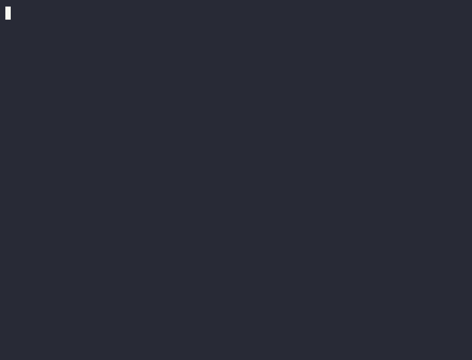

# aiflow

[](https://github.com/cyber93de/aiflow)

**aiflow macht aus jedem Repository mit einem Befehl eine gesteuerte, KI-getriebene
Software-Delivery-Pipeline.** Es verbindet **Claude Code, GitHub Copilot und OpenAI Codex CLI** —
agent-agnostisch, beliebig kombinierbar — mit dauerhaftem Task-Tracking, einem zweischichtigen
Code-Gedächtnis (struktureller **Graph** + semantisches **RAG**), autonomen Arbeitsschleifen,
spezialisierten Review-/Audit-Agenten, Token-/Kostenkontrolle, erzwungenem Code-Stil, einem
konfigurierbaren Git-Branching-Modell mit automatisierten Release-Workflows und erstklassiger
**Teamarbeit** — damit ein KI-Coding-Agent (oder ein ganzes Team aus Menschen + Agenten) ein Issue
nehmen, planen, den Code in konsistentem Stil schreiben, testen, gegen Akzeptanzkriterien prüfen,
auditieren und über einen echten Release-Prozess ausliefern kann.

**Die meisten scheitern daran, ihr KI-Projekt erfolgreich aufzusetzen — gerade ohne tiefes
KI-Know-how. Genau dafür ist dieses Tool gebaut:** ein paar Fragen beantworten, fertig ist ein
erprobtes, meinungsstarkes Setup.

- **Agent-agnostisch** — [Claude Code](https://docs.claude.com/en/docs/claude-code) (volles
  Feature-Set: Subagenten, Hooks, Slash-Commands), **GitHub Copilot** und **OpenAI Codex CLI**
  lesen alle dieselbe gemeinsame `AGENTS.md` + bekommen je eigene gerenderte MCP-Config. Der
  **Ralph-Loop** funktioniert über alle drei via
  [open-ralph-wiggum](https://github.com/Th0rgal/open-ralph-wiggum). Siehe
  [Multi-Agent Support](https://cyber93de.github.io/aiflow/multi-agent).
- **Token-basiert & anbieterneutral** — dein eigener Anthropic-API-Key *oder* Claude-Code-OAuth-Token;
  Git-Hosts **nur über Tokens, nie OAuth**. Kein Dritt-Hub.
- **Local-First-Option** — leichte Arbeit auf **Ollama**-Modellen (kein Key), Top-Modelle fürs
  schwere Nachdenken.
- **Projekt-scoped** — Secrets und Einstellungen liegen im Projekt (`.env`, `.aiflow/config.json`),
  nie global.
- **Plattformübergreifend** — Windows, Linux, macOS.

> 🇬🇧 This guide is also available in **[English → README.md](README.md)**.

**Version 0.7.0 · MIT-Lizenz · [Changelog](CHANGELOG.md) ·
📖 [Doku-Seite](https://cyber93de.github.io/aiflow/)**

---

## Inhalt

1. [Warum aiflow — die Vorteile](#1-warum-aiflow--die-vorteile)
2. [Feature-Überblick](#2-feature-überblick)
3. [Installation](#3-installation)
4. [Ein erstes Projekt bauen (Walk-through)](#4-ein-erstes-projekt-bauen-walk-through)
5. [Die Tools, die aiflow installiert](#5-die-tools-die-aiflow-installiert)
6. [Memory: warum Graph *und* RAG](#6-memory-warum-graph-und-rag)
7. [Agenten — die volle Übersicht](#7-agenten--die-volle-übersicht)
8. [Slash-Commands and Skills](#8-slash-commands-and-skills)
9. [Delivery-Workflow & Branching-Modelle](#9-delivery-workflow--branching-modelle)
10. [Teamarbeit (mehrere Mitglieder)](#10-teamarbeit-mehrere-mitglieder)
11. [Remote-Host konfigurieren (GitHub / GitLab / Custom)](#11-remote-host-konfigurieren)
12. [Claude-Zugang, Ollama & weitere Modelle](#12-claude-zugang-ollama--weitere-modelle)
13. [Arbeiten mit context7](#13-arbeiten-mit-context7)
14. [Eigene MCP-Server hinzufügen](#14-eigene-mcp-server-hinzufügen)
15. [Konfiguration, die du anpassen solltest (AGENTS.md, Preferences, …)](#15-konfiguration-die-du-anpassen-solltest)
16. [Kommando-Referenz](#16-kommando-referenz)
17. [Token- & Kostenoptimierung](#17-token--kostenoptimierung)
18. [CI/CD & Releases bauen](#18-cicd--releases-bauen)
19. [Projektstruktur](#19-projektstruktur)
20. [FAQ](#20-faq)
21. [Fehlerbehebung](#21-fehlerbehebung)
22. [Credits & Dank](#22-credits--dank)
23. [Feedback, Ideen & Bug-Meldungen](#23-feedback-ideen--bug-meldungen)
24. [Mitwirken](#24-mitwirken)
25. [Lizenz](#25-lizenz)

📖 **Vollständige Doku-Seite:** [cyber93de.github.io/aiflow](https://cyber93de.github.io/aiflow/) —
inkl. **[AI Basics](https://cyber93de.github.io/aiflow/ai-basics)** (Claude Code, Agents, Memory,
Context-Windows, Skills, Hooks — einfach erklärt) und einem kompletten
**[Beispielprojekt-Walk-through](https://cyber93de.github.io/aiflow/example-project)** (jede Frage,
jeder Default, erstes Feature end-to-end).

---

## 1. Warum aiflow — die Vorteile

- **Eine starke Grundkonfig schlägt keine Konfig.** Die meisten KI-Coding-Projekte starten mit
  blankem Claude und erfinden Regeln, Memory und Workflow ad hoc — oder nie. Ziel von aiflow ist
  **eine sehr gute, universelle Grundkonfiguration**, die überall sofort funktioniert und dir rund
  **70–80 % des Konfigurationsaufwands** gegenüber dem Blank-Start spart. Die Agenten und Regeln
  sind bewusst **generisch** — passe sie an dein Projekt an (siehe §7 und §15), aber selbst
  unangepasst schlagen sie blankes Claude.
- **Production-Ready-Code ist das eigentliche Ziel.** Die Agenten erzeugen Code, der ausgeliefert
  werden soll: wiederverwendbar, zuverlässig, sicher, auf aktuellen Standards; sie kennen und
  respektieren deine Architektur, erweitern sie sinnvoll, betrachten Unpassendes kritisch und
  schlagen neue Layer vor (Caching, Suche, Service-Schnitte), wo Performance oder andere Ziele es
  verlangen. Auf Wunsch liefern sie zusätzlich Auswertungen zu **Barrierefreiheit (WCAG)**,
  **Modernisierungspotential** und **Security-Issues**.
- **Ehrlich bei Tokens.** Token-Sparen ist ein Ziel — caveman, rtk, Graph-/RAG-Retrieval zahlen
  darauf ein —, wird aber wegen der vielen Qualitätsregeln (Tests, Reviews, Gates) pro Aufgabe nur
  **bedingt** erreicht. Die Gegenrechnung: Wer Anforderungen nicht mehrfach stellen und
  nachschärfen muss, weil sie beim **ersten** Durchlauf production-ready umgesetzt werden, spart
  am Ende Tokens **und Zeit**.
- **Besseres Gedächtnis, weniger Halluzinationen.** Zwei komplementäre Code-Indizes plus dauerhaftes
  Task-Memory: Der Agent *schlägt nach*, statt zu raten oder Dutzende Dateien neu zu lesen. Siehe §6.
- **Starke Token-Reduktion.** caveman (knappe Ausgabe, ~75 % weniger Output-Tokens), rtk
  (CLI-Ausgabe-Filterung 60–90 % weniger), Graph-+RAG-Retrieval (~70 % weniger als ganze Dateien
  lesen) und optionales günstiges/lokales Model-Routing. Gemessen mit `aiflow cost`.
- **Teamfähig.** Issues liegen in einer geteilten Dolt-Datenbank, die über den Git-Remote synct.
  Atomares Claiming verhindert Doppelgriff; Pull-vor-Push verhindert Überschreiben. Siehe §10.
- **Gesteuert & auditierbar.** Conventional Commits, erzwungener Google-Stil, Review-Gate gegen
  Akzeptanzkriterien, Security-/Quality-/Deps-/Test-/Perf-/Docs-Audits, echtes Branching-+Release-Modell.
- **Autonom, wenn du willst.** Die Ralph-Schleife erledigt eine Aufgabe unbeaufsichtigt (lokal, im
  Container oder in CI) und stoppt bei `COMPLETE`/`BLOCKED`.
- **Deins, kein Hub.** Alles läuft auf deinen Keys/Tokens und deiner Infrastruktur; Secrets verlassen
  das Projekt nie.

---

## 2. Feature-Überblick

| Bereich | Was du bekommst |
|---------|-----------------|
| **Task-Tracking** | Beads (`bd`) — Dolt-basierte Issues mit Abhängigkeiten, Status, Historie; übersteht Context-Resets |
| **Code-Memory** | **graphify** (Struktur-Graph) + **cocoindex-code** (semantisches RAG) + `.claude/memory/`-Fakten |
| **Externe Docs** | **context7** MCP — aktuelle, versionsgenaue Bibliotheks-Doku |
| **Versionskontrolle** | Wahl **git**, **svn** oder **keine** beim Setup |
| **Remote-Host** | GitHub, GitHub Enterprise, GitLab, self-managed GitLab, Bitbucket, Forgejo, Gitea oder Custom-URL — **token-basiert** |
| **Host-MCP** | Der passende Git-Host-MCP wird automatisch verdrahtet (je Remote-Typ) |
| **Modelle** | Claude (API-Key *oder* OAuth) + optionale **Ollama**-Modelle, wählbar & auto-installiert |
| **Model-Routing** | claude-code-router schickt leichte/Hintergrund-Arbeit an günstige/lokale Modelle |
| **Agenten** | 5 Delivery- + 9 Audit-/Checker- + 1 Brownfield-Spezialist-Subagenten |
| **Autonomie** | Ralph-Schleife (interaktiv / headless / containerisiert / CI) |
| **Qualität** | Google-Stil, Conventional Commits, Format-/Lint-/Test-Git-Hooks, Architekt+Quality-Gate-Review, statische Analyse bei jeder Änderung, objektive Metrik-Ziele (0 neue Smells/Duplikate, 0 Warnings), >80 % Coverage + BDD-E2E-Gates, Logging mit Leveln, `.http`-Dateien für REST-Endpunkte, DB-Regeln §3c (3NF+FKs für neue Schemata, Brownfield-Schemata mit Vorsicht) |
| **Branching** | simple / gitflow / none, PR-only, Auto-Release, SemVer/CalVer |
| **Team** | geteilte Issue-DB, atomares Claim, Session-Start-Auto-Pull, Pull-vor-Push, geteilte Preferences |
| **Token-Ersparnis** | Claude Code: caveman + rtk standardmäßig an, Graph-/RAG-Retrieval, Cost-Routing. Copilot: [Token-Optimization-Guide](https://github.com/olivomarco/github-copilot-token-optimization) fest in `copilot-instructions.md`. Codex: optional [CodexSaver](https://github.com/fendouai/CodexSaver)-MCP-Router (`codexsaver.enabled`) |

---

## 3. Installation

**Voraussetzung:** [Node.js](https://nodejs.org) (LTS). Alles andere kann aiflow für dich installieren.

> **Windows: das gehört vor den Clone.** aiflow selbst läuft in PowerShell + Git Bash, aber alles,
> was **nativen Code kompiliert** (C/C++, `node-gyp`, Python-C-Extensions), gehört ins **WSL** —
> niemals MinGW/MSYS2. Das zu überspringen ist die häufigste Ursache für ein gescheitertes
> Windows-Setup.
> 1. **Intel VT-x** bzw. **AMD SVM Mode** im BIOS/UEFI aktivieren (Task-Manager → Leistung → CPU →
>    *Virtualisierung: Aktiviert*).
> 2. Admin-PowerShell: `wsl --install` → Neustart (aktiviert WSL + Plattform für virtuelle Computer).
> 3. `wsl --install -d Ubuntu`, einmal starten; `wsl -l -v` muss **VERSION 2** zeigen.
> 4. Im WSL: `sudo apt update && sudo apt install -y build-essential` → `gcc`/`g++`; je nach Projekt
>    zusätzlich `cmake`, `python3-dev`, eine Cross-Toolchain, …
>
> Komplette Anleitung inkl. Begründung gegen MinGW:
> [Doku — Windows prerequisites](https://cyber93de.github.io/aiflow/installation#windows-prerequisites-do-this-first).
> `aiflow doctor` prüft alle vier Schritte.

### Windows (PowerShell)
```powershell
git clone https://github.com/Cyber93de/aiflow.git
cd aiflow
./install.ps1            # legt den aiflow-Shim an + ergänzt den User-PATH
aiflow doctor            # funktioniert sofort in diesem Fenster; sonst neues Terminal öffnen
```

<p align="center"></p>

### Linux (bash)
```bash
git clone https://github.com/Cyber93de/aiflow.git
cd aiflow
bash install.sh          # verlinkt 'aiflow' in deinen PATH (~/.local/bin oder /usr/local/bin)
aiflow doctor
```

### macOS (Terminal)
```bash
git clone https://github.com/Cyber93de/aiflow.git
cd aiflow
bash install.sh          # wie Linux; optionale Tools kommen über Homebrew, wenn vorhanden
aiflow doctor
```

<p align="center"></p>

Auf jedem OS **fragt der Installer einmalig**, ob zusätzlich **git**, **Subversion (svn)** und
**Ollama** installiert werden sollen — damit ein späteres `aiflow init` nur noch fragt, *welche*
Ollama-Modelle du willst. Danach:

```bash
aiflow install-deps --all   # restliche Toolchain (optional; init bietet es auch an)
```

Oder ein fertiges Build von
**[github.com/Cyber93de/aiflow/releases](https://github.com/Cyber93de/aiflow/releases)** holen.

---

## 4. Ein erstes Projekt bauen (Walk-through)

```bash
mkdir my-app && cd my-app
aiflow init                 # interaktives Q&A → schreibt .aiflow/config.json → rendert alles
aiflow init --no-token-saving   # dito, aber caveman + rtk aus (volle, ungefilterte Ausgabe)
```

<p align="center"></p>

`aiflow init` fragt (Enter = sinnvoller Default; Token-Sparen + intensives Graph-Memory sind **an**):

1. **caveman / rtk** — Token-sparende Ausgabe + CLI-Filterung (Default an).
2. **graphify** (Struktur-Graph) und **cocoindex-code** (semantisches RAG) — Code-Memory (Default an).
3. **task-master**, **filesystem MCP**, **context7 MCP** (Default an).
4. **Memory** — persistentes Memory, Graph-Lernen und **Intensität** (Default `aggressive`).
5. **Claude-Zugang** — `apikey` (ANTHROPIC_API_KEY) oder `oauth` (`claude setup-token`).
6. **Versionskontrolle** — `git` / `svn` / `none`.
7. **Remote-Host** — `github | github-enterprise | gitlab | gitlab-self | bitbucket | forgejo |
   gitea | custom | none`, plus welcher **Host-MCP** verdrahtet wird. Token-basiert.
8. **Sync-Regel** — bei jedem Beads-Close nach Push + Dolt-Sync fragen; Auto-Pull bei Session-Start.
9. **Ollama** — einrichten? welche Modelle? (`qwen3-coder` empfohlen).
10. **Geteilte Team-Preferences** — Code-Stil etc.
11. **Projektziel / Architektur / OS / IDE** und das **Git-Branching-Modell** (falls VCS = git).

> **Das Projektziel (Aim) nicht überspringen — der günstigste Qualitätshebel.** Das Aim stimmt
> Claude auf *dein* Projekt ab: Jeder Agent liest es vor Planung und Code. Nenne es aiflow beim
> `init` (Frage 11) oder später via `aiflow change-settings` — oder pflege es manuell in
> **`.claude/memory/project-aim.md`** und **`AGENTS.md §1`**. Ein gutes Aim sind 2–4 klare Sätze:
> *was* das Produkt tut, *für wen*, die *Zielarchitektur* und der *Qualitätsanspruch*. Beispiel:
> *„REST-API für Auftragsverwaltung unserer internen Shops. Hexagonale Architektur auf PostgreSQL.
> Korrektheit und Nachvollziehbarkeit schlagen Tempo; jeder Endpunkt wird vollständig getestet."*

Dann Secrets füllen und starten:

```bash
# .env bearbeiten → Git-Host-Token + (ANTHROPIC_API_KEY oder CLAUDE_CODE_OAUTH_TOKEN)
aiflow shell                # lädt .env, startet Claude Code mit allen MCPs
```

In der Session:

```text
/beads:ready                # was ist bereit
bd create "Health-Endpoint" -t task --claim   # Task anlegen + claimen
/implement                  # implementer baut es (Code + Tests, Google-Stil)
/review-ac                  # reviewer prüft gegen Akzeptanzkriterien
```

**Bestehende Codebasis (Brownfield)?** `aiflow init` erkennt sie und bietet `aiflow onboard` an —
lernt den Code in `.claude/memory/`, `AGENTS.md` und arc42, damit der Agent informiert startet, und
**schlägt aus dem gebildeten Verständnis ein Projektziel (Aim) vor**. Der Vorschlag wird nicht
stillschweigend übernommen: Der Onboarder **fragt dich, ob es so stimmt** (Headless-Läufe
markieren es als `PROPOSED — please confirm` in `project-aim.md`). Danach lohnt
`aiflow modernize-check` — ein Modernisierungsbericht, den der Architekt in Beads überführen kann:

<p align="center"></p>

Code-Indizes jederzeit mit **`aiflow index`** bauen (Graph + RAG).

---

## 5. Die Tools, die aiflow installiert

`aiflow install-deps` installiert nur, was deine Config aktiviert (`--all` = voller Satz). Alles im
User-Space; Docker wird nie automatisch installiert.

**Kern (immer):** Beads (`bd`) · Dolt (Beads-Backend) · jq · das zum Remote passende Git-Host-CLI
(`gh`/`glab`).

**Coding-Agent-CLIs (je `agents.*`):** Claude Code (`agents.claude`, standardmäßig an) ·
**GitHub Copilot CLI** (`agents.copilot`, `npm i -g @github/copilot`) · **OpenAI Codex CLI**
(`agents.codex`, `npm i -g @openai/codex`). Beliebig kombinierbar — siehe
[Multi-Agent Support](https://cyber93de.github.io/aiflow/multi-agent).

**Optional (wenn aktiviert):** claude-task-master · claude-code-router · rtk · **graphify**
(braucht `uv`) · **cocoindex-code** (`ccc`, braucht `uv`) · **Ollama** (+ gewählte Modelle) ·
**CodexSaver** (`codexsaver.enabled`, braucht `agents.codex` + Python — kostenbewusster
MCP-Router für Codex CLI, Clone + editable Pip-Install, kein veröffentlichtes Paket).

Headless-Container-Runs (`docker/run.sh`) und der GitHub-MCP laufen mit **Podman oder Docker** —
eines davon selbst installieren (wird nie automatisch installiert).

`aiflow doctor` zeigt Vorhandenes plus eine Projekt-Zusammenfassung (Remote + Host-MCP, VCS,
Ollama-Modelle, Memory: Graph/RAG/context7 + Intensität).

---

## 6. Memory: warum Graph *und* RAG

LLMs vergessen zwischen Sessions und verbrennen Tokens beim erneuten Lesen. aiflow gibt dem Agenten
einen **geschichteten Context-Stack**, sodass er eine Frage an die günstigste passende Quelle
*routet*. Die volle Routing-Tabelle steht in `.claude/memory/memory-policy.md`:

| Bedarf | Quelle | Warum |
|--------|--------|-------|
| Aktuelle Task, Deps, Entscheidungen, Session-State | **Beads** (`bd`) | strukturiertes Arbeits-Memory, übersteht Compaction |
| Dauerhafte Projektfakten / Gotchas / Umgebungsdetails | **memory-Dateien** (`.claude/memory/`) | Prosa, nicht in Code/Git |
| Wo ist ein Symbol definiert, wer ruft es, Dependency-Richtung | **graphify** (MCP) | exakter Struktur-Graph — kein Re-Scan |
| „Finde Code über Konzept X" / semantisch / unscharf | **cocoindex-code** (`ccc` / MCP) | AST-bewusstes RAG, lokale Embeddings, ~70 % weniger Tokens |
| Externe Bibliotheks-/Framework-API-Doku | **context7** (MCP) | aktuelle Upstream-Docs, vermeidet Halluzinationen |
| Alles noch Ungeklärte | Datei(en) lesen | erst nachdem Graph + RAG das Ziel eingegrenzt haben |

**Warum ein Graph?** Code *ist* ein Graph (Imports, Calls, Typen). Ein Graph beantwortet
*strukturelle* Fragen („wer ruft `parseToken`? wovon hängt `auth` ab?") exakt und günstig — kein
Raten, kein Neulesen, und er verhindert DRY-Verletzungen, weil der Agent bestehenden Code *sehen* kann.

**Warum zusätzlich RAG?** Ein Graph beantwortet keine *unscharfen* Fragen („wo ist die Retry-Logik?").
cocoindex-code chunkt den Code AST-bewusst, embeddet ihn **lokal** (sentence-transformers, kein Key)
und sucht nach Bedeutung — ~70 % weniger Tokens als Dateien zu öffnen. Inkrementell: nur geänderte
Dateien werden neu embeddet.

**Beide** Indizes nach größeren Änderungen mit einem Befehl aktualisieren:

```bash
aiflow index            # = graphify build  +  ccc index   (inkrementell)
```

---

## 7. Agenten — die volle Übersicht

Spezialisierte Subagenten liegen in `.claude/agents/`. Claude wählt anhand der `description` oder du
rufst sie explizit auf. Die mitgelieferten Agenten sind **bewusst generisch** — ein starker,
universeller Startpunkt, nicht das Ziel: **passe sie an die Bedürfnisse deines Projekts an**
(Markdown editieren: Prompt, `tools:`, `model:` — z. B. deine Fachsprache, dein Review-Fokus,
dein Test-Stack).

### Delivery-Agenten (machen die Arbeit)
| Agent | Rolle |
|-------|-------|
| **architect** | Systemdesign — ADRs, arc42-Updates, Task-Aufschlüsselung. Kein Feature-Code. |
| **planner** | Wandelt Ziel/Epic/Issue in kleine Beads-Tasks mit testbaren Akzeptanzkriterien + echten Abhängigkeiten. |
| **implementer** | Senior Engineer für genau einen bereiten Bead — Voranalyse (Architektur-Fit, Aufwand, Komplexität) vor dem Code, zielgenaues Refactoring wenn nötig, SOLID/DRY/KISS/YAGNI, testbar by design (DI, deterministisch), bewährte Frameworks/Patterns statt Eigenbau, PO-verständliche Rückfragen mit festgehaltenen Entscheidungen, Quality Gates (statische Analyse, >80 % Coverage, BDD-E2E, Logging, `.http`-Dateien, Metrik-Ziele). |
| **reviewer** | Architekt **und** Quality Gate in einem — Architektur-/Design-/Risiko-Review (Layer, Modulgrenzen, SOLID, technische Schulden, Over-/Underengineering, Schwachstellen, Concurrency, Breaking Changes) plus die objektive §3a-Checkliste; Suggestions werden als Beads für die nächste Loop festgehalten. PASS / CHANGES REQUIRED. |
| **tester** | Test-/QA-Engineer — Negativ-/Edge-/Boundary-/Exception-/Invalid-Input-Tests plus Testqualitäts-Audit (Assertions, Determinismus, Unabhängigkeit); läuft, wenn die Voranalyse hohes Risiko/Komplexität meldet; meldet Bugs, statt Tests zu schwächen. |

### Audit-Agenten (manuell, read-only auf Code, legen priorisierte Beads an)
| Agent | Kommando | Issue-Label |
|-------|----------|-------------|
| **security-advisor** | `aiflow security-check` | `[security-advisor]` |
| **quality-check** | `aiflow quality-check` | `[technical issue]` |
| **dependency-auditor** | `aiflow dependency-check` | `[dependency]` |
| **test-gap-advisor** | `aiflow test-gap` | `[test gap]` |
| **performance-advisor** | `aiflow perf-check` | `[performance]` |
| **docs-sync** | `aiflow docs-check` | `[docs]` |
| **accessibility-checker** | `aiflow a11y-check` | `[accessibility]` — strikte WCAG-2.2-AA-Prüfung aller UI-Oberflächen; empfiehlt zudem ein automatisiertes A11y-Tool für die E2E-Suite (axe-core/Pa11y/Lighthouse CI). Nicht Teil der Delivery-Loop. |
| **requirements-check** | `aiflow requirements-check` | *nur Bericht* (bewertet Issue-Qualität vs. Architektur; ändert nichts) |
| **modernization-advisor** | `aiflow modernize-check` | *nur Bericht* — geht komplett über den Brownfield-Code und schlägt Modernisierungskonzepte vor (Microservices statt Monolith, REST/Cloud-Native statt SOAP/Legacy-MQ, git statt svn, supportete Stacks, fehlende Unit-/BDD-/E2E-Test-Frameworks) → `.aiflow/modernization-report.md`; der Architekt reviewt manuell und füttert akzeptierte Konzepte optional als Beads. Nicht Teil der Delivery-Loop. |

### Brownfield-Agent
| Agent | Rolle |
|-------|-------|
| **onboarder** | Studiert eine bestehende Codebasis und persistiert Gelerntes in `.claude/memory/`, `AGENTS.md` und arc42 — künftige Sessions starten informiert; schlägt ein Projektziel (Aim) vor und fragt dich, ob es stimmt. Schreibt nur Docs/Memory. |

**Was alle Delivery-Agenten gemeinsam haben:** nur Production-Ready-Output (Vorsicht bei Technologie
mit geringem Reifegrad — Reviewer und Tester bemängeln sie), kleine Klassen / KISS (Divide & Conquer
+ Interfaces statt Riesenklassen), State-of-the-Art als Default (Legacy-Wünsche wie SOAP oder
XML-über-REST werden hinterfragt, nie stillschweigend gebaut), Monolithen-Vermeidung und bewusste
Daten-/Performance-Entscheidungen (Redis/SQLite/Elasticsearch geprüft, wo sie sich lohnen).
Volle Details pro Agent: [Docs → Agents](https://cyber93de.github.io/aiflow/agents).

---

## 8. Slash-Commands and Skills

Zwei verschiedene Claude-Code-Mechanismen, beide dabei:

**Slash-Commands** — explizit ausgelöst, `.claude/commands/`:
- **Delivery:** `/intake-issue <n>` (GitHub/GitLab/Bitbucket-Issue → Beads),
  `/decompose <ziel|prd>` (task-master → Beads), `/plan-epic`,
  `/implement [bead] [ralph|no-ralph]` (Voranalyse zuerst; ohne Angabe entscheidet der implementer
  **automatisch** — oder folgt einem „use the Ralph loop"-Vermerk direkt im Issue), `/review-ac`,
  `/arch "<Frage>"`.
- **Audits:** `/security-check`, `/quality-check`, `/requirements-check`, `/dependency-check`,
  `/test-gap`, `/perf-check`, `/docs-check`, `/a11y-check` (strikt WCAG), `/modernize-check`
  (Brownfield-Modernisierungsbericht), `/ponytail-review` (Over-Engineering-Audit des aktuellen Diffs).
- **Brownfield / Orientierung:** `/onboard`, `/explain <pfad>`, `/standup`.

Beads und die Ralph-Schleife gibt es auch als Plugin-Commands (`/beads:ready`, `/beads:decision`,
`/ralph-loop`).

**Skills** — automatisch angeboten, `.claude/skills/<name>/SKILL.md`, Claude Code gleicht die
`description` des Skills gegen den aktuellen Kontext ab und bietet ihn an (vor größeren Änderungen
wird nachgefragt). Ein **Agent** ist eine Rolle (wer handelt, mit welcher Befugnis, in welcher
Reihenfolge); ein **Skill** ist Wissen, das mehrere Rollen brauchen — der Implementierer, der einen
Endpunkt baut, und der Reviewer, der ihn prüft, lesen dieselbe Liste. Vollständiger Katalog:
[Skills](https://cyber93de.github.io/aiflow/skills).
- **Technologie-Stacks** — **stack-embedded** (C/C++-Firmware: HAL-Trennung, keine Allokation nach
  Init, ISR-Disziplin, Host-Tests gegen gemockte HAL), **stack-mobile** (Flutter/Dart, Kotlin/
  Android, Swift/iOS: Schichtung, State-Management, Process Death, Offline/Sync, Keystore/
  Keychain), **stack-web-frontend** (Angular/React/Vue: Feature-Slices, Server- vs. Client-State,
  XSS und Token-Handling, Core Web Vitals, i18n, a11y), **stack-backend** (Spring/Quarkus/Jakarta,
  .NET, Rust, Node, Go, Python: hexagonale Schichtung mit Ports, Transaktionsgrenzen, Resilienz,
  Observability, FOSS-first).
- **Integration & Daten** — **api-design** (REST-Versionierung/Idempotenz/`problem+json`/OpenAPI/
  `.http`, wann SOAP legitim ist und wie man davon wegkommt, GraphQL-/gRPC-Abwägungen),
  **messaging-events** (Kafka/RabbitMQ/NATS, idempotente Consumer, Transactional Outbox,
  Reihenfolge, DLQs, Sagas), **data-storage** (SQL als Default, wann NoSQL berechtigt ist,
  In-App-Datenbanken, Redis mit echter Cache-Invalidierung, Elasticsearch als abgeleitete
  Leseschicht), **cloud-native** (Container-Images, K8s-Probes/Limits/Rollout/Secrets, EC2,
  modularer Monolith vs. Microservices).
- **security** — OWASP Top 10 als Prüfraster + ASVS-Level, IAM mit Least Privilege (Rollen,
  kurzlebige Credentials, Rotation), API-AuthN/AuthZ, Secrets, Krypto, Supply Chain. Der
  security-advisor nutzt dasselbe Raster.
- **seo-optimization** — SEO für jedes webbasierte Projekt (HTML, GitHub Pages, statische Seiten,
  Doku-Seiten, Landing Pages, Blogs, Next.js, Astro, Hugo, Jekyll, VuePress, VitePress, React,
  Vue, Svelte, Angular, …): Meta-Tags, Open Graph/Twitter Cards, JSON-LD Structured Data,
  robots.txt/sitemap.xml, Canonical URLs, Überschriften-Hierarchie, Alt-Texte, Core Web Vitals,
  GitHub-Pages-Spezifika (Base-URL, 404, Social Preview, RSS). Bietet sich automatisch an, wenn
  Web-Inhalte vorhanden sind/entstehen; endet mit SEO-Bericht (umgesetzt / offen / Priorität /
  Empfehlungen).
- **ponytail** — YAGNI-Entscheidungsleiter vor neuem Code: muss es überhaupt existieren? schon im
  Code vorhanden? in der Standardbibliothek? native Plattform-Funktion? bereits installierte
  Abhängigkeit? eine Zeile? erst dann der minimal nötige neue Code. Standardmäßig aus — aktivieren
  mit `ponytail.enabled`/`.mode` (`full`/`lite`/`ultra`) via `aiflow init` oder
  `aiflow change-settings`. `/ponytail-review` prüft ein Diff unabhängig vom Schalter auf
  Over-Engineering.
- **memory-setup** — das volle Memory-/Context-Routing-Bild: was speichern, Priorität
  (Beads → Memory-Dateien → graphify → cocoindex-code → context7), geteilte Team-Präferenzen,
  Ollama-Routing. AGENTS.md §8 behält nur Schalter + Essenzielles; der Rest steht hier.

Eigene Skills: neues `<name>/SKILL.md` in `.claude/skills/` ablegen — siehe die mitgelieferten für
das erwartete Frontmatter (`name`, `description`) und die Struktur. **Eine `description` mit
Doppelpunkt muss in Anführungszeichen** — `description: zwei Hüte: Architekt …` ist ungültiges
YAML, und nichts warnt davor: Skill oder Command fallen still auf ihren Fließtext als Beschreibung
zurück (treffen also die selbst geschriebenen Trigger-Wörter nicht mehr), ein Agent verschwindet
komplett aus dem Roster. Der `pre-commit`-Hook des generierten Projekts prüft das mit
`.github/scripts/check-frontmatter.py` über alle Agents, Commands und Skills, sobald du eine
solche Datei stagest; die CI prüft es bei jedem Push erneut. Der Hook braucht `python3`/`python`
+ PyYAML — fehlen sie, sagt er das und überspringt, die CI bleibt das Sicherheitsnetz.

---

## 9. Delivery-Workflow & Branching-Modelle

```
Issue (GitHub / GitLab / Bitbucket / …)
  └─ /intake-issue ─▶ Beads-Tasks (mit Akzeptanzkriterien)
       └─ /decompose (task-master) ─▶ Subtasks + Abhängigkeiten
            └─ bd ready --claim ─▶ Task wählen & claimen
                 └─ /implement ─▶ Code + Tests, Google-Stil      (implementer)
                      └─ /review-ac ─▶ Gate gegen Akzeptanzkriterien (reviewer)
                           └─ Commit (Conventional Commits + Bead-ID) ─▶ PR ─▶ Release
                                └─ aiflow close-sync ─▶ Push + Dolt-Sync der Issues
```

Ein Feature end-to-end — Task, Voranalyse, PO-Frage mit festgehaltener Entscheidung, versionierte +
gesicherte API, Tests + `.http`-Datei, Review-Gate, Close:

<p align="center"></p>

**Branching-Modelle** (`aiflow init` / `change-settings`, nur bei VCS = git). aiflow schreibt
`.aiflow/branching.json` + lesbares `docs/branching.md`, legt permanente Branches an, seedet
`VERSION` und installiert die Durchsetzung:

- **Modell** — `simple` (main + develop) · `gitflow` (`feature/*`/`bugfix/*` aus develop, `hotfix/*`
  aus main) · `none`.
- **main ist eingeschränkt (gitflow)** — nur `develop`, `hotfix/*` oder `chore/*` dürfen je auf
  `main` landen; `feature/*`/`bugfix/*` gehen immer auf `develop`. Reine Doku- und
  CI/Workflow-Datei-Änderungen zählen als `chore/*`.
- **Strikte Regeln** — Branch-Quellen/-Ziele und Namen erzwingen.
- **PR-only** — kein Direktpush auf main/develop; Merge nur per validiertem PR.
- **Auto-Release** — develop trägt `X.Y.0-SNAPSHOT`; Merge nach main streicht das Suffix (**Minor**-
  Release). `aiflow hotfix <name>` bumpt einen Hotfix-Branch auf `X.Y.(Z+1)-HOTFIX`; Merge nach
  main streicht das Suffix (**Patch**-Release) und merged den Hotfix zusätzlich nach develop.
  `chore/*` → main löst nie einen Release aus, und main darf selbst nie eine
  `-SNAPSHOT`/`-HOTFIX`-Version tragen. Releasen braucht immer explizite, menschliche
  Bestätigung — nie automatisch.
- **Versionsstrategie** — SemVer oder CalVer; optionale Release-Tags.
- **chore/\*** — Chore-Branches unabhängig von feature/hotfix-Regeln.

Durchsetzung: der `pre-push`-Hook blockt Direktpushs auf geschützte Branches, blockt
`feature/*`/`bugfix/*`-Merges auf `main` und weist jeden Push auf `main` mit
`-SNAPSHOT`/`-HOTFIX`-Version zurück; `aiflow protect` setzt echten serverseitigen Branch-Schutz
auf GitHub; `aiflow release [--yes] [--push]` zeigt erst einen Dry-Run und erhöht Version, taggt
und bumpt develop erst mit `--yes`.

---

## 10. Teamarbeit (mehrere Mitglieder)

Beads-Issues liegen in einer **geteilten Dolt-Datenbank**, die über `refs/dolt/data` am Git-Remote
synct — ein Issue-Graph fürs ganze Team, kein Extra-Server.

- **Sync bei Session-Start.** Ein `SessionStart`-Hook führt `bd dolt pull` aus (sicher, best-effort,
  pusht nie; Opt-out über `sync.pullOnStart`). Oder manuell: `aiflow sync`.
- **Atomar claimen.** `bd ready --claim` / `bd update <id> --claim` setzt assignee = du + Status =
  in_progress in einem Schritt, sodass **zwei Leute nie dieselbe Task greifen**. `bd ready
  --unassigned` zeigt freie Arbeit.
- **Immer Pull vor Push.** `aiflow sync` und `aiflow close-sync` pullen zuerst, damit du die
  Issue-Änderungen der Kollegen mergst statt sie zu überschreiben. Bei Konflikt: `bd dolt pull`
  (mergen), auflösen, pushen. Nie force-pushen.
- **Status ist das Koordinationssignal.** Aktuell halten; veralteter Status = Doppelarbeit.
- **Queue-Modus: ein geschlossener Task beendet keine Session.** Nach jedem Close frischt der Agent
  die Queue auf und startet den nächsten Task — `aiflow next` rankt ihn (Priorität → entblockt am
  meisten → Fortsetzung des gerade geschlossenen Beads). Schluss ist nur aus einem echten Grund:
  nichts Handlungsfähiges übrig, alles blockiert, du sagst Stopp, oder eine Entscheidung, die nur du
  treffen kannst. Ein `Stop`-Hook reicht den nächsten Task einmal nach, falls der Agent es vergisst;
  abschaltbar über `.aiflow/config.json → beads.queueMode = false` oder `AIFLOW_QUEUE_MODE=off`.
- **Entdeckte Arbeit → neuer Bead** (`--deps discovered-from:<id>`); **Entscheidungen →
  `/beads:decision`** (mit Begründung) — so sieht das ganze Team das *Warum*.
- **Geteilte Preferences** (Code-Stil, Sprache) liegen in einer committeten
  `.aiflow/team-prefs.json` — das ganze Team erbt sie; persönliche Anpassungen bleiben lokal.

---

## 11. Remote-Host konfigurieren

aiflow ist **nur token-basiert — kein OAuth für Git-Hosts**. Typ bei init/change-settings wählen; das
passende CLI und der MCP werden automatisch verdrahtet.

| Remote-Typ | Base-URL | Token-Env (`.env`) | Host-MCP |
|------------|----------|--------------------|----------|
| `github` | github.com | `GITHUB_TOKEN` | github-mcp-server |
| `github-enterprise` | deine GHE-URL | `GITHUB_TOKEN` | github-mcp-server (`GITHUB_HOST`) |
| `gitlab` / `gitlab-self` | gitlab.com / deine URL | `GITLAB_TOKEN` | server-gitlab (`GITLAB_API_URL`) |
| `bitbucket` | deine URL | `BITBUCKET_TOKEN` | atlassian-bitbucket |
| `forgejo` / `gitea` | deine URL | `GIT_REMOTE_TOKEN` | gitea-mcp-server (`GITEA_URL`) |
| `custom` | beliebig | dein Env-Name | aus Liste wählen (oder `none`) |
| `none` | — | — | keiner — komplett lokal, kein MCP für einen Git-Host |

**GitHub-Beispiel:** PAT mit repo + issues + pull_requests scope erstellen → in `.env` als
`GITHUB_TOKEN`. **GitLab-Beispiel:** Personal Access Token mit `api`-Scope → `GITLAB_TOKEN`. Für
self-managed/Enterprise die Base-URL bei init angeben; aiflow verdrahtet API-URL/Host in den MCP.

Jeder Host bekommt zudem ein **vordefiniertes Release-Publish-Workflow**, einmalig geschrieben
(nie überschrieben, falls schon eins existiert): `.github/workflows/release.yml`,
`.gitlab-ci.yml`, `.gitea/workflows/release.yml`, `.forgejo/workflows/release.yml` oder
`bitbucket-pipelines.yml`. Es triggert bei einem Versions-Tag-Push (den `aiflow release --push`
erzeugt) und legt einen Release-Eintrag/Notiz auf dem Host an — es bumpt selbst nie eine Version,
das bleibt der lokale, menschlich bestätigte `aiflow release --yes`-Schritt.

**GitKraken** ist ein Git-Client, kein Host — ein eigener `gitkraken.enabled`-Schalter verdrahtet
dessen MCP (über die `gk`-CLI) *zusätzlich* zum oben gewählten Remote-Typ, oder auch allein mit
`remote.type: none`.

Beads-Issue-Sync (`bd github`/`bd gitlab`) und Dolt-Sync nutzen denselben Remote. Alles später mit
`aiflow change-settings` ändern (rendert `.mcp.json`, Hooks, alles neu).

---

## 12. Claude-Zugang, Ollama & weitere Modelle

**Claude-Zugang** (`.aiflow/config.json → claude.auth`, beides möglich, OAuth gewinnt bei beidem):
- `apikey` → `ANTHROPIC_API_KEY` (pay-per-use, [console.anthropic.com](https://console.anthropic.com)).
- `oauth` → `claude setup-token` → `CLAUDE_CODE_OAUTH_TOKEN` (nutzt deinen Claude-Plan).

**Ollama (lokal, kein API-Key).** Bei init aktivieren oder:
```bash
aiflow ollama add qwen3-coder     # Modell zur Config hinzufügen + ziehen
aiflow ollama pull                # alle Config-Modelle ziehen
aiflow ollama list                # installierte anzeigen
```
Gewählte Modelle werden in `.aiflow/router-config.json` als Provider geschrieben, damit sie für
leichte/Hintergrund-Arbeit tatsächlich genutzt werden:
```bash
aiflow shell --router             # routet günstige/Hintergrund-Schritte an lokale Modelle
```

**Weitere / Cloud-Modelle** (DeepSeek, OpenRouter, Gemini, …): Provider + Key in
`~/.claude-code-router/config.json` (nie committen) eintragen und `router` in der Config aktivieren.
`.env` listet optionale Keys (`DEEPSEEK_API_KEY`, `OPENROUTER_API_KEY`, `GEMINI_API_KEY`). Triviale
Schritte an günstige Modelle, Top-Claude fürs schwere Nachdenken; messen mit `aiflow cost`.

---

## 13. Arbeiten mit context7

**context7** ist ein MCP-Server, der **aktuelle, versionsgenaue Doku** für deine Bibliotheken holt —
damit der Agent gegen die echte aktuelle API programmiert statt gegen ein veraltetes Gedächtnis.
Standardmäßig an (`mcp.context7`).

- In der Session einfach normal fragen („nutze die aktuelle `zod`-Schema-API") — der Agent ruft
  context7 für aktuelle Docs. Du kannst auch anstoßen: *„prüf context7 für die aktuelle
  Prisma-migrate-API"*.
- Funktioniert **keyless**; ein `CONTEXT7_API_KEY` in `.env` erhöht die Rate-Limits.
- Kombiniere es mit den Code-Indizes: **context7** = *externe* Lib-Docs, **graphify/cocoindex** =
  *dein* Code.

---

## 14. Eigene MCP-Server hinzufügen

aiflow generiert `.mcp.json` aus `.aiflow/config.json`, aber du kannst jeden weiteren MCP-Server
ergänzen — deine Einträge zu Servern, die aiflow nicht verwaltet, bleiben beim Neu-Rendern erhalten:

```jsonc
{
  "mcpServers": {
    "my-server": {
      "command": "npx",
      "args": ["-y", "@scope/my-mcp-server"],
      "env": { "MY_TOKEN": "${MY_TOKEN}" }   // Secrets über .env, nie inline
    }
  }
}
```

Dann in `.claude/settings.json` unter `permissions.allow` erlauben (z. B. `"mcp__my-server"`) und
jedes Secret in `.env` (gitignored) legen. Für geprüfte Community-Server:
`npx claude-code-templates@latest`. Tipp: lieber ein fokussierter MCP als ein breiter — weniger Tools
= weniger Context und weniger Fehltritte.

---

## 15. Konfiguration, die du anpassen solltest

Alles wird von **`.aiflow/config.json`** gesteuert (committet, keine Secrets). Interaktiv mit
`aiflow change-settings` bearbeiten (rendert `.mcp.json`, Hooks, Branching, Memory neu) —
Versionskontrolle wechseln (git/svn), andere Ollama-Modelle wählen oder Token-Sparen komplett
abschalten mit `--no-token-saving`:

<p align="center"></p>

Am lohnendsten:

- **`AGENTS.md`** — die Betriebsregeln, die jeder Agent liest (Projektüberblick, Architektur-Hinweise,
  Code-Stil, Task-Workflow, Git-Regeln, Memory-/Context-Stack, Kommunikation). **Fülle die
  `[EDIT ME]`-Blöcke** (§1 Überblick, §2 Architektur) — der größte Qualitätshebel.
- **`.aiflow/team-prefs.json`** („Preferences") — geteilte, versionierte Team-/Nutzer-Preferences:
  Code-Stil-Preset, Sprache, Konventionen. Committet, damit das Team sie erbt; überschreibt
  `AGENTS.md §3`.
- **`.claude/memory/`** — `project-aim.md` (Ziel + Architektur), `dev-environment.md`,
  `memory-policy.md` (Retrieval-Routing + Lern-Intensität). Aktuell halten.
- **`.claude/settings.json`** — Permissions (allow/deny), Hooks (caveman, Formatter, beads-sync),
  MCP-Allow-List.
- **`.aiflow/branching.json` / `docs/branching.md`** — das Branching-/Release-Modell.
- **`.env`** — alle Tokens/Keys (gitignored, nie global).

Form von `config.json`:
```jsonc
{
  "caveman":  { "enabled": true, "mode": "full" },
  "rtk":      { "enabled": true },
  "router":   { "enabled": false },
  "graphify": { "enabled": true },
  "taskmaster": { "enabled": true },
  "mcp":      { "filesystem": true, "context7": true, "cocoindex": true },
  "memory":   { "enabled": true, "graph": true, "intensity": "aggressive" },
  "claude":   { "auth": "apikey" },
  "vcs":      { "system": "git" },
  "remote":   { "type": "github", "baseUrl": "https://github.com",
                "api": "github-api", "tokenEnv": "GITHUB_TOKEN", "mcp": "github" },
  "sync":     { "askOnClose": true, "pullOnStart": true },
  "ollama":   { "enabled": false, "url": "http://localhost:11434", "models": [] },
  "teamPrefs":{ "enabled": false, "codeStyle": "google" },
  "project":  { "aim": "…", "architecture": "…" },
  "dev":      { "os": "windows", "ide": "vscode" },
  "git":      { "model": "gitflow", "strict": true, "prOnly": true,
                "autoRelease": true, "versionStrategy": "semver", "releaseTags": true, "chore": true }
}
```

---

## 16. Kommando-Referenz

```text
aiflow init [pfad] [--force] [--no-git] [--no-beads] [--yes] [--no-token-saving]
                                   Projekt bootstrappen (--no-token-saving = caveman + rtk aus)
aiflow install-deps [--all]        fehlende Tools installieren (config-abhängig; --all = voller Satz)
aiflow change-settings [--no-token-saving]   Config neu justieren, dann alles neu rendern
aiflow shell [--router]            .env laden, Claude Code starten (--router = günstige/lokale Modelle)
aiflow sync [pull|push|both]       Team-Sync: git + Beads(dolt) pull/push
aiflow close-sync <id>             bei Issue-Close: Push + Dolt-Sync anbieten
aiflow next [--after <id>] [--claim] [--json]  naechster ready Beads-Task, gerankt (Queue-Modus)
aiflow ollama [pull|add <m>|list]  lokale Ollama-Modelle verwalten
aiflow index                       Code-Memory aktualisieren: graphify (Graph) + cocoindex (RAG)
aiflow ralph "<prompt|bead id>"    die Headless-Ralph-Schleife laufen lassen
aiflow onboard                     bestehende Codebasis in Memory + AGENTS.md + arc42 lernen
aiflow security-check | quality-check | requirements-check | dependency-check
aiflow test-gap | perf-check | docs-check | a11y-check   On-Demand-Audits → Beads-Issues
aiflow modernize-check             Brownfield-Modernisierungskonzepte → Bericht für den Architekten
aiflow release [--push]            Release gemäß Branching-Modell schneiden
aiflow protect                     serverseitigen Branch-Schutz anwenden (GitHub)
aiflow cost [...]                  Token-/Kosten-Baseline via ccusage
aiflow doctor                      Voraussetzungen + Projekt-Zusammenfassung prüfen
aiflow upgrade                     gebündelte Toolchain aktualisieren
aiflow update                      aiflow selbst aktualisieren (git pull, oder GitHub-Release-Download bei Nicht-Git-Install)
aiflow project-update               DIESES Projekt auffrischen (Skripte inkl. .github/scripts + Agent-Defs
                                    + .githooks;
                                    angepasste Dateien -> *.bak; .github/workflows bleibt unangetastet)
aiflow version
```

---

## 17. Token- & Kostenoptimierung

**Erwartung zuerst:** Token-Sparen ist ein echtes Ziel, aber die vielen Qualitätsregeln (Tests,
Coverage-Gates, statische Analyse, Architekten-Review) geben bewusst Tokens dafür aus, es gleich
richtig zu machen. Der Netto-Gewinn kommt daher, dass man **nicht zweimal fragen muss**: eine
Anforderung, die beim ersten Durchlauf production-ready ist, braucht kein Re-Prompting und keine
Nacharbeit — das spart mehr Tokens (und Zeit) als jeder Output-Filter. Die Hebel unten trimmen
den Rest:

- **caveman** — knapper Ausgabemodus (~75 % weniger Output-Tokens; Code/Commits/Security bleiben normal). Default an.
- **rtk** — filtert/komprimiert ausführliche Kommando-Ausgaben vor dem Context (60–90 % weniger). Default an.
- **Lieber volle Ausgabe?** `aiflow init --no-token-saving` / `aiflow change-settings --no-token-saving`
  schaltet caveman + rtk mit einem Flag ab.
- **Graph + RAG** — aus graphify/cocoindex antworten statt ganze Dateien lesen (~70 % weniger).
- **Model-Routing** — leichte/Hintergrund-Schritte an günstige oder lokale (Ollama) Modelle via `aiflow shell --router`.
- **ponytail** (Standard aus) — weniger Tokens für Code, den niemand gebraucht hat; siehe §8.
- **Erst messen** — `aiflow cost` (ccusage) zeigt echte Ausgaben, damit du das Richtige optimierst.

---

## 18. CI/CD & Releases bauen

- **`.github/workflows/ci.yml`** — validiert die Toolchain bei push/PR: `bash -n` auf allen Scripts,
  shellcheck (advisory), JSON-Validierung der Templates, PowerShell-Parse und ein **Dry-Run-Build**
  der Per-OS-Archive (als Artefakt hochgeladen).
- **`.github/workflows/release.yml`** — bei jedem Push auf `main`, wenn `VERSION` keinen passenden Tag
  hat: baut Per-OS-Archive (`linux.tar.gz`, `macos.tar.gz`, `windows.zip` + SHA256SUMS), taggt
  `v<VERSION>` und veröffentlicht einen GitHub-Release. **`VERSION` bumpen, pushen → Release.**
- **Projekte** bekommen ebenfalls `.github/workflows/ci.yml` (erkennt Node/Python/Go/Dart → Format +
  Tests) und `.github/workflows/agent.yml` (Ralph-Schleife in CI per Dispatch, `agent`-Label oder
  nightly; Auth aus `ANTHROPIC_API_KEY` **oder** `CLAUDE_CODE_OAUTH_TOKEN` Repo-Secrets).

Lokal genauso bauen wie CI:
```bash
ver=$(cat VERSION); stage="aiflow-$ver"
mkdir -p "dist/$stage" && cp -r bin lib templates install.sh install.ps1 README*.md LICENSE VERSION "dist/$stage/"
( cd dist && tar -czf "aiflow-$ver-linux.tar.gz" "$stage" )
```

---

## 19. Projektstruktur

```
dein-projekt/
├─ .aiflow/
│  ├─ config.json            # die zentrale Wahrheit (committet)
│  ├─ team-prefs.json        # geteilte Team-Preferences (committet)
│  ├─ router-config.json     # generiert: Ollama/Cost-Provider (gitignored)
│  ├─ bd-close-sync.sh       # Close → Push + Dolt-Sync anbieten
│  ├─ next-task.sh           # naechster ready Bead, gerankt (Queue-Modus)
│  └─ *.sh                   # Audit-/Release-/Ralph-Helfer
├─ .beads/                   # Beads-Issue-Datenbank (Dolt)
├─ .claude/
│  ├─ agents/  commands/     # Subagenten + Slash-Commands
│  ├─ hooks/                 # caveman, Formatter, beads-sync (SessionStart), queue-continue (Stop)
│  ├─ memory/                # project-aim, dev-environment, memory-policy
│  └─ settings.json          # Permissions + Hooks + MCP-Allow-List
├─ .githooks/                # commit-msg, pre-commit, pre-push (Durchsetzung)
├─ docs/architecture/        # arc42 + ADRs
├─ .mcp.json                 # aus Config generiert (Host-MCP, graphify, cocoindex, context7, …)
├─ AGENTS.md                 # Betriebsregeln, die jeder Agent liest
└─ .env                      # Secrets (gitignored, nie global)
```

---

## 20. FAQ

**Brauche ich einen Anthropic-API-Key?** Entweder API-Key *oder* Claude-Code-OAuth-Token (`claude
setup-token`) — `claude.auth` bei init wählen.

**Funktioniert es offline / privat?** Code-Indexing (cocoindex-code) und Embeddings sind **lokal**
(kein Key). Mit Ollama laufen auch Modelle lokal. Claude selbst ruft weiter Anthropic.

**Werden meine Daten irgendwohin gesendet?** Secrets bleiben in `.env` (gitignored, nie global). Nur
was Claude für eine Anfrage braucht, geht an Anthropic (oder an deine lokalen Modelle über den Router).

**graphify vs. cocoindex — brauche ich beides?** Sie ergänzen sich: graphify beantwortet
*strukturelle* Fragen exakt; cocoindex *semantische/unscharfe* günstig. Beides empfohlen (§6).

**Wie binde ich ein weiteres Modell ein?** Ollama: `aiflow ollama add <modell>`. Cloud: in
`~/.claude-code-router/config.json` eintragen und `router` aktivieren (§12).

**Wie nutze ich GitLab / Bitbucket / self-hosted statt GitHub?** `aiflow change-settings` →
Remote-Typ wählen (oder `custom` + Base-URL) → Token in `.env` (§11).

**Können mehrere Leute in einem Projekt arbeiten?** Ja — Kernfeature (§10): geteilte Dolt-Issue-DB,
atomares Claim, Session-Start-Pull, Pull-vor-Push.

**Wie ändere ich später etwas?** `aiflow change-settings` fährt das Q&A erneut und rendert
`.mcp.json`, Hooks, Branching und Memory aus der neuen Config.

**Muss ich Tools vorinstallieren?** Nein. Der Installer bietet git/svn/ollama an; `aiflow
install-deps` (oder `aiflow init`) installiert den Rest.

**Etwas verweist auf den falschen Git-Host / Token?** `aiflow change-settings` erneut; prüfe, dass
`.env` das in `remote.tokenEnv` genannte Env hat; `aiflow doctor` zeigt die aufgelöste Config.

---

## 21. Fehlerbehebung

- **`jq is required`** — jq installieren (`aiflow install-deps` tut es). aiflow liest/schreibt `config.json` damit.
- **`bd`/Dolt-Fehler** — `aiflow install-deps` installiert beides; `bd dolt status` prüft den Server.
- **MCP-Server startet nicht** — `aiflow doctor`; prüfe, dass das Tool installiert ist (`ccc`,
  `graphify`, Docker für den GitHub-MCP) und das Token-Env in `.env` zu `remote.tokenEnv` passt.
- **Ollama-Modelle ungenutzt** — `router` aktivieren und `aiflow shell --router`; prüfe, dass
  `.aiflow/router-config.json` deine Modelle listet und `ollama list` sie hat.
- **Dolt-Sync-Konflikt** — `bd dolt pull` (mergen), auflösen, dann `bd dolt push`. Nie force-pushen.
- **Bug melden** — Issue unter https://github.com/Cyber93de/aiflow/issues mit Reproschritten.

---

## 22. Credits & Dank

aiflow ist Klebstoff. Riesiger Dank an die Projekte, auf denen es steht — bitte sterne und unterstütze sie:

- **[Claude Code](https://docs.claude.com/en/docs/claude-code)** (Anthropic) — die Agenten-Laufzeit, auf der alles aufbaut.
- **[Beads](https://github.com/steveyegge/beads)** — Dolt-basierter Issue-Tracker; dauerhaftes Task-Memory über Sessions.
- **[Dolt](https://github.com/dolthub/dolt)** (DoltHub) — die versionierte SQL-DB, die Team-Issue-Sync möglich macht.
- **[graphify](https://github.com/safishamsi/graphify)** — der strukturelle Code-Wissensgraph über MCP.
- **[CocoIndex](https://github.com/cocoindex-io/cocoindex)** & **[cocoindex-code](https://github.com/cocoindex-io/cocoindex-code)** — das inkrementelle, AST-bewusste semantische RAG (`ccc`).
- **[Context7](https://github.com/upstash/context7)** (Upstash) — aktuelle, versionsgenaue Lib-Docs über MCP.
- **[claude-task-master](https://github.com/eyaltoledano/claude-task-master)** — Ziel/PRD → Task-Baum.
- **[claude-code-router](https://github.com/musistudio/claude-code-router)** — Model-Routing für Kosten/lokale Modelle.
- **[Ollama](https://ollama.com)** — lokale Model-Laufzeit (kein API-Key).
- **[rtk](https://www.rtk-ai.app/)** — CLI-Ausgabe-Filterung zur Context-Reduktion.
- **[ccusage](https://github.com/ryoppippi/ccusage)** — Token-/Kosten-Analyse.
- **[claude-code-templates](https://github.com/davila7/claude-code-templates)** — Community-Agenten/Commands/MCPs/Hooks.
- **[Model Context Protocol](https://github.com/modelcontextprotocol/servers)** — das MCP-Server-Ökosystem.

Marken und Projekte gehören ihren jeweiligen Eigentümern; aiflow ist eine unabhängige Integration und
weder mit ihnen verbunden noch von ihnen empfohlen.

---

## 23. Feedback, Ideen & Bug-Meldungen

**Dieses Projekt lebt von deinem Input — und der ist sehr willkommen.** Ob grobe Idee,
Feature-Wunsch, ein „warum funktioniert das so?" oder klare Kritik: nur her damit. Ehrliches Feedback
macht aiflow besser.

- 💡 **Ideen & Anregungen** — eröffne eine [GitHub Discussion](https://github.com/Cyber93de/aiflow/discussions)
  oder ein [Issue](https://github.com/Cyber93de/aiflow/issues). Keine Idee ist zu klein oder zu wild.
- 🗣️ **Kritik erwünscht** — sag uns, was verwirrend, umständlich oder fehlend ist. Widerspruch ist nützlich.
- 🐛 **Bug-Meldungen** — [Issue](https://github.com/Cyber93de/aiflow/issues) mit Reproschritten,
  deinem OS und der relevanten `aiflow doctor`-Ausgabe. Kleine Repro = schneller Fix.
- 🙌 **Unterstützung** — wenn aiflow dir hilft, freut ein ⭐ auf dem Repo, ein geteilter Link oder ein
  nettes Wort ehrlich. Danke, dass du dabei bist.

Es gibt **keine Bezahlstufe und keine Spendenbitte** — die beste Unterstützung ist dein Feedback, ein
Stern und eine Empfehlung.

---

## 24. Mitwirken

Issues und PRs willkommen unter **https://github.com/Cyber93de/aiflow**. aiflow nutzt sich selbst:
Beads für die eigenen Tasks, Conventional Commits, und der CI-Workflow (`bash -n`, shellcheck, JSON- +
PowerShell-Validierung) muss grün sein. Änderungen projekt-scoped und secret-frei halten.

---

## 25. Lizenz

**MIT** — Copyright (c) 2026 Cyber93de. Siehe [LICENSE](LICENSE).

aiflow bündelt nichts — es installiert/ruft externe Tools auf, jedes unter eigener Lizenz. Siehe
[THIRD_PARTY_LICENSES.md](THIRD_PARTY_LICENSES.md) für die Attribution.

---

<sub>**Themen / Keywords:** Claude Code · Anthropic Claude · AI Coding Agent · agentische
Software-Delivery · MCP (Model Context Protocol) · Beads · Dolt · graphify · Code-Wissensgraph ·
CocoIndex · cocoindex-code · semantische Codesuche · RAG · Context7 · Ollama · lokales LLM ·
claude-code-router · rtk · caveman · ponytail · YAGNI · Token-Optimierung · Ralph-Loop · gitflow · Conventional Commits ·
GitHub · GitLab · Bitbucket · Forgejo · Gitea. &nbsp;·&nbsp; Empfohlene GitHub-Repo-Topics:
`claude-code`, `anthropic`, `ai-agent`, `mcp`, `beads`, `rag`, `code-search`, `ollama`, `context7`,
`rtk`, `caveman`, `ponytail`, `developer-tools`, `cli`.</sub>
